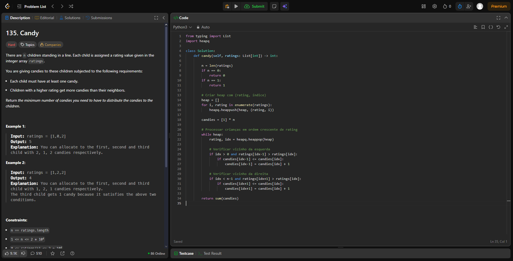
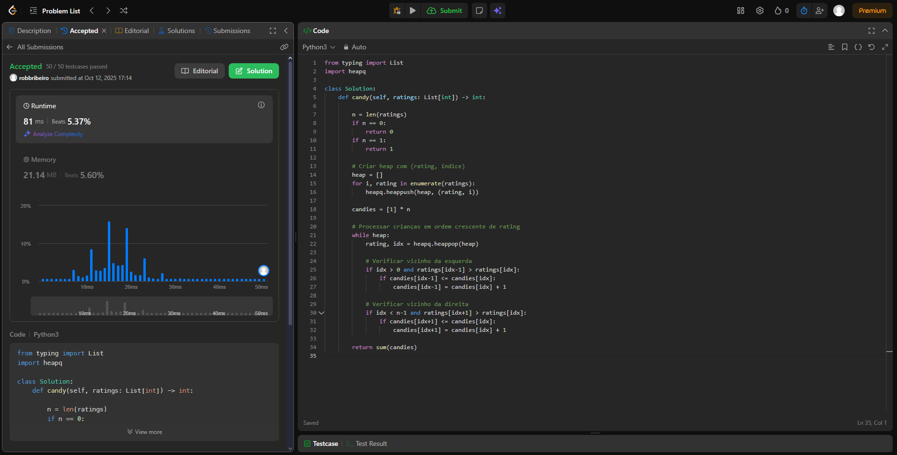
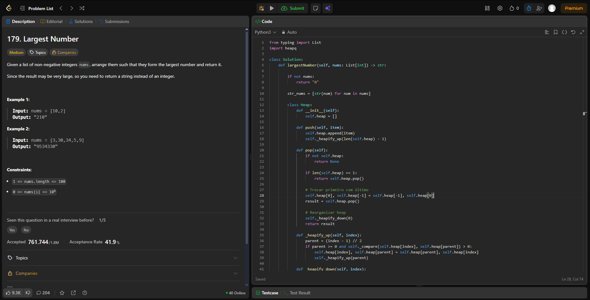
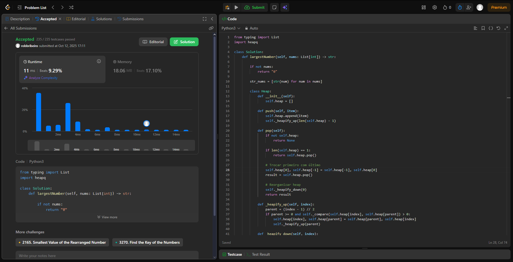
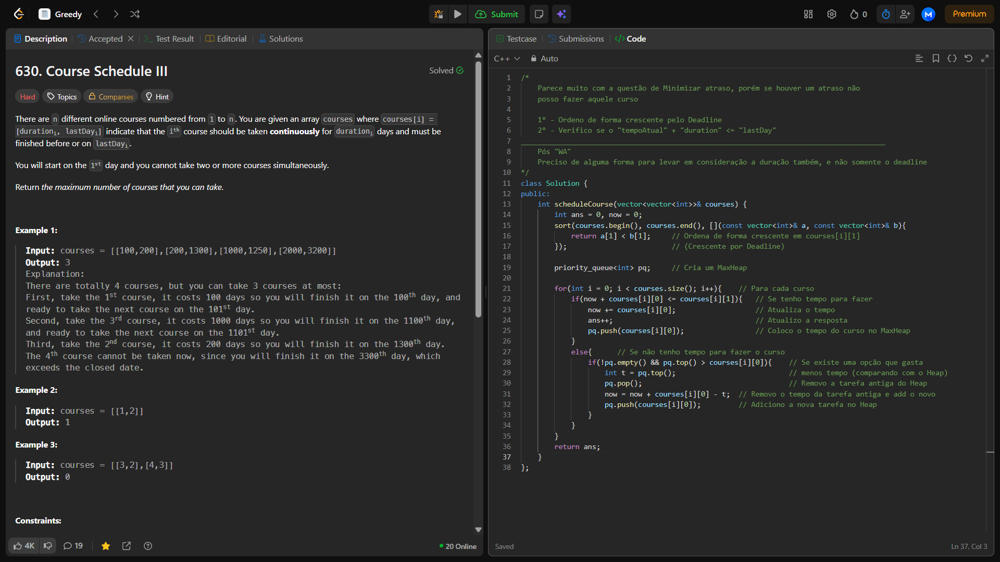
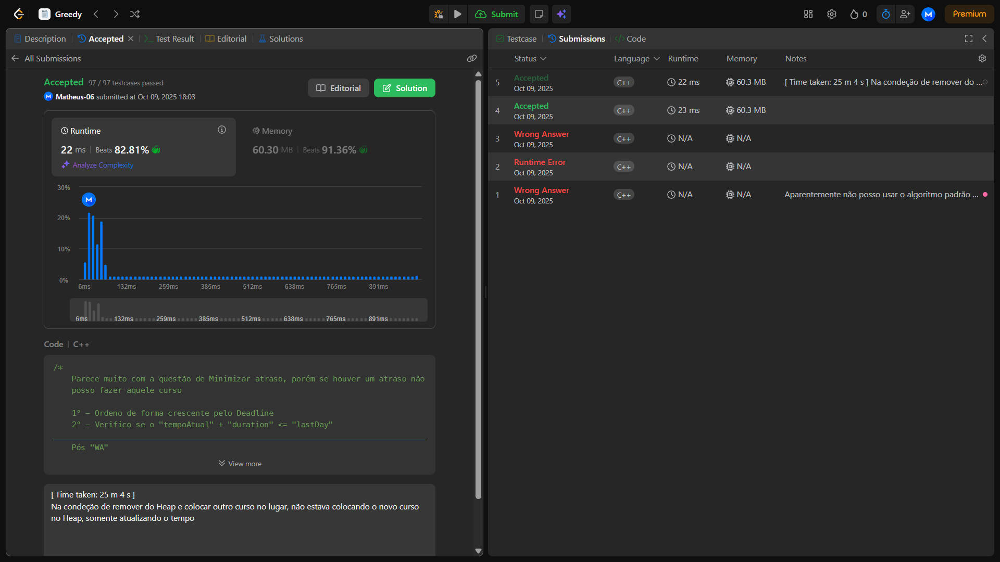
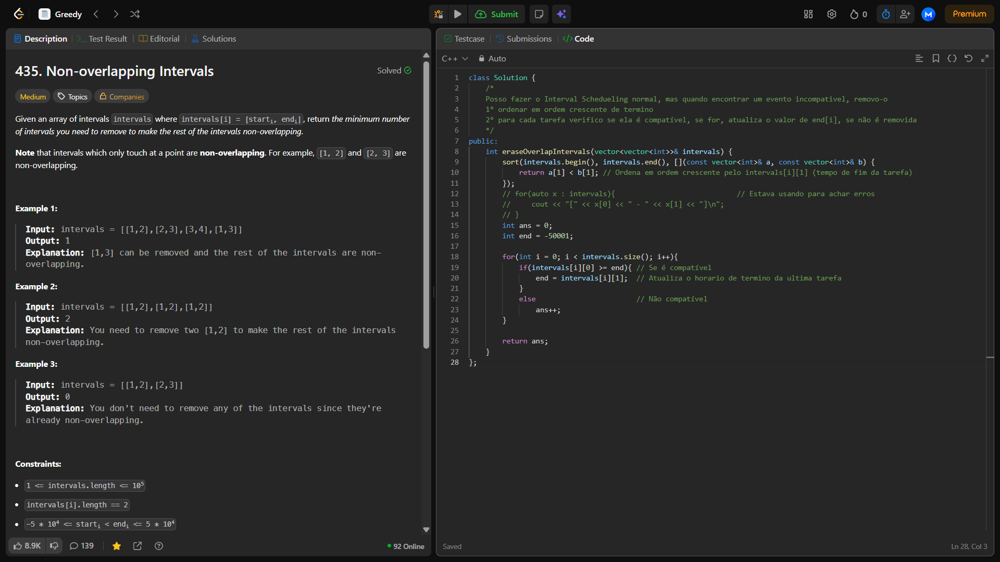
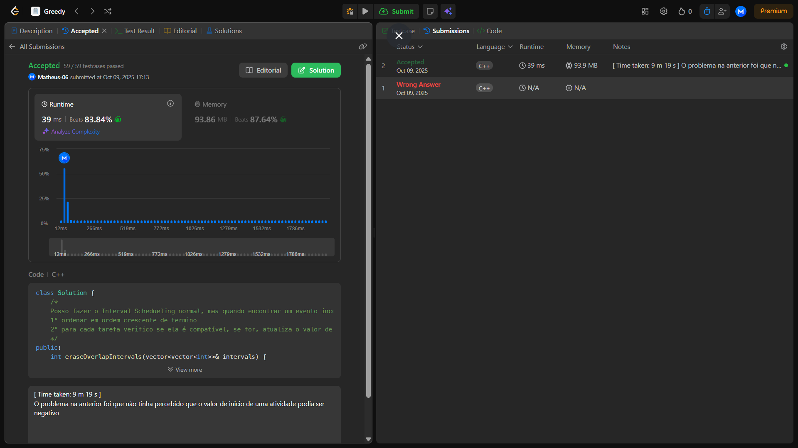

# Greed_Dupla-60

**Número da Lista**: 60 
**Conteúdo da Disciplina**: Algoritmos Ambiciosos 

## Alunos
|Matrícula | Aluno |
| -- | -- |
| 24/1025336  |  Matheus Pinheiro |
| 22/1022730   |  Robson Junio Ribeiro Macedo |

## Sobre 
Foram escolhidos quatro exercícios da plataforma online e dividido entre a dupla [LeetCode](https://leetcode.com/):
- Dois de nível difícil.
- Dois de nível médio.

## Screenshots
-[135. Candy (Difícil)](https://leetcode.com/problems/candy/)

[Código](code/135.py)

-[179. Largest Number (Médio)](https://leetcode.com/problems/largest-number/)

[Código](code/179.py)

-[630. Course Schedule iii (Difícil)](https://leetcode.com/problems/course-schedule-iii/)

[Código](code/630.cpp)

-[435. Non Overlapping Intervals (Médio)](https://leetcode.com/problems/non-overlapping-intervals/)

[Código](code/435.cpp)

## Instalação 
**Linguagem**: Python e C++  

## Video
-inserir video

## Outros 

